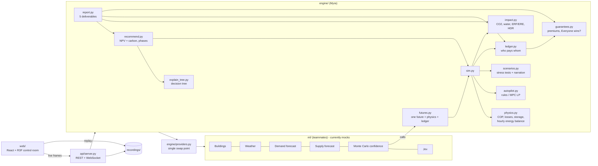

# HeatOS

> Data center heat that neighbors can count on, with a price for that certainty.

HeatOS is a decision-support platform and live control room for reusing data center waste heat, built for the
NYU Grundfos/HDR "Data Center Heat Reuse" challenge. It doesn't design new hardware. It picks the most cost-
and carbon-efficient way to deliver heat using existing, commercially available equipment (heat exchangers,
heat pumps, thermal storage, with each building's existing boiler kept as backup), then runs and prices that
network.

1. **Analyze** a site's buildings.
2. **Recommend** which buildings connect, with what equipment and in which phase, and explain each choice with a decision tree.
3. **Run the network live**, hour by hour, under a rules or MPC autopilot, and fire stress tests.
4. **Show who pays whom** and whether every party comes out ahead, with a confidence score on every decision.
5. **Generate the five written deliverables** from the live model.

Two sites: **Chelsea** (111 8th Ave, ambient loop, recommended) and **Lansing** (Lake Hawkeye, warm loop).

## Run it

```bash
make setup     # Python 3.11 venv via uv + npm install (needs uv and Node 20+)
make dev       # API on :8000 + control room on http://localhost:5173
make test      # 100 backend tests
make record    # re-record the demo runs used by Replay mode
```

- **Replay mode.** If the API isn't running, the UI says `REPLAY` and plays recorded runs from `recordings/`,
  with identical visuals. Stress-test buttons switch to the matching recording.
- **FPS check.** Open `http://localhost:5173/?fps` for a frame-rate overlay.

### Demo script

| Key | Step |
|---|---|
| `1` | Analyze: buildings rise, coloured by heat use |
| `2` | Recommend: pipes draw in; a public-housing tower opens its Why? path |
| `3` | Stress-test: press again to fire the Polar vortex |
| `4` | Switch to Lansing |
| `5` | Fire the Bitcoin price crash |
| `6` | Deal & Report: opens the generated report |
| `Q`-`T` | Fire the site's stress tests directly |
| `C` | 20 s cinematic flythrough |
| `Space` | Play / pause |

The **Demo** button runs the same sequence automatically, pausing where the presenter presses a stress test.

## Architecture



| Path | What it does |
|---|---|
| `engine/contracts.py` | The interface with the ML team (pydantic v2); mirrored in `web/src/types.ts` and checked by a parity test |
| `engine/providers.py` | The only place mock vs real providers are chosen |
| `engine/mocks.py` | Synthetic buildings, weather, demand, supply, confidence, Jev |
| `engine/config.py`, `engine/sites/*.yaml` | Site configs; every number has a source or "assumption - verify" |
| `engine/physics.py` | COPs, pipe losses (MST routes), pumping, storage, cooling sales; energy balance checked every hour |
| `engine/autopilot.py` | Rules policy, MPC (48 h LP, CVXPY + HiGHS), `compare_autopilots()` |
| `engine/sim.py` | Orchestrator: step-by-step for streaming, or a full year in about 0.1 s |
| `engine/scenarios.py` | 8 stress tests (polar vortex, tenant leaves, server outage, heat wave, price spike, lake-effect cold snap, greenhouse off-season, bitcoin crash) |
| `engine/recommend.py` | Option-by-option 20-yr NPV incl. carbon; greedy tree-growing plan within firm capacity; phases |
| `engine/explain_tree.py` | Decision tree trained on 5,000 labelled variants; per-building Why? path |
| `engine/ledger.py`, `engine/guarantees.py` | Money flows, capex by party, NPV/payback, Sankey; guarantee premiums (E + CVaR95); lever search |
| `engine/impact.py`, `engine/site_scoring.py` | Impact ranges + HDR scorecard; Deliverable 1 (4.00 vs 3.35, Chelsea wins ~97%) |
| `engine/report.py` | Markdown / HTML / PDF report generated from live state |
| `api/server.py`, `api/live.py` | FastAPI: `/run`, `/scenario`, `/autopilot`, `/speed`, `/pause`, `/bundle`, `/plan`, `/explain/{id}`, `/tree`, `/site-scores`, `/deal`, `/compare`, `/impact`, `/report`, `WS /stream/{run_id}` |
| `scripts/record.py` | Records every stress test for Replay mode |
| `web/` | Control room (Vite, React, TypeScript, React Three Fiber, Zustand, Framer Motion, Tailwind, Recharts, d3-sankey) |

## For the ML team

Read **[ml/README.md](ml/README.md)**: exact function signatures, data shapes, units and definitions. To swap a
mock for your module, edit only the `REGISTRY` block in `engine/providers.py`; every hook is tagged
`ML_TEAM_INTEGRATION`. Your Monte Carlo engine calls the engine's simulator
(`providers.SIMULATOR.simulate_future(plan, state, inputs)`), so you never re-implement physics or money.
After any swap, run `make test` and then `make record`.

## Current results (mock data, so illustrative)

| | Chelsea | Lansing |
|---|---|---|
| Buildings connected | 5 of 40 (pilot sized to firm capacity) | 17 of 25 |
| Net CO2 avoided / yr | ~3,470 t | ~10,150 t |
| Everyone wins? | Not yet (guarantee buyers near break-even) | Yes |
| Stress tests | Polar vortex drops confidence to ~0, verdict ESCALATE | Resilient: pit storage + surplus heat absorb every test |
| MPC vs rules | -2.3% cost on the price spike; parity elsewhere | parity |

Known limitations: building data is mock until the teammates' LL84/PLUTO pipeline lands; Monte Carlo confidence
is 40-100 uniform-jitter futures until the LHS + GEV engine lands; PDF export uses xhtml2pdf (install the
`pdf` extra plus system Pango for WeasyPrint quality).
